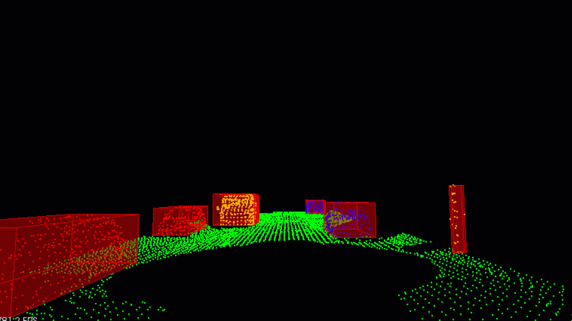

# Sensor Fusion Self-Driving Car Course



### Welcome to the Sensor Fusion course for self-driving cars.

In this course we will be talking about sensor fusion, whch is the process of taking data from multiple sensors and combining it to give us a better understanding of the world around us. we will mostly be focusing on two sensors, lidar, and radar. By the end we will be fusing the data from these two sensors to track multiple cars on the road, estimating their positions and speed.

**Lidar** sensing gives us high resolution data by sending out thousands of laser signals. These lasers bounce off objects, returning to the sensor where we can then determine how far away objects are by timing how long it takes for the signal to return. Also we can tell a little bit about the object that was hit by measuring the intesity of the returned signal. Each laser ray is in the infrared spectrum, and is sent out at many different angles, usually in a 360 degree range. While lidar sensors gives us very high accurate models for the world around us in 3D, they are currently very expensive, upwards of $60,000 for a standard unit.

**Radar** data is typically very sparse and in a limited range, however it can directly tell us how fast an object is moving in a certain direction. This ability makes radars a very pratical sensor for doing things like cruise control where its important to know how fast the car infront of you is traveling. Radar sensors are also very affordable and common now of days in newer cars.

**Sensor Fusion** by combing lidar's high resolution imaging with radar's ability to measure velocity of objects we can get a better understanding of the sorrounding environment than we could using one of the sensors alone.

## Classroom Workspace

The workspace provided in the SFND classroom comes preinstallated with everything that you need to finish the exercises and projects. Versions used by Udacity for this ND are as follows:

* Ubuntu 16.04
* PCL - v1.7.2
* C++ v11
* gcc v5.5

**Note** The [[CMakeLists.txt](https://github.com/udacity/SFND_Lidar_Obstacle_Detection/blob/master/CMakeLists.txt)] file provided in this repo can be used locally if you have the same package versions as mentioned above. If you want to run this project locally (outside the Udacity workspace), please follow the steps under the **Local Installation** section.


## Local Installation

### Ubuntu 

1. Clone this github repo:

   ```sh
   cd ~
   git clone https://github.com/udacity/SFND_Lidar_Obstacle_Detection.git
   ```

2.  Edit [CMakeLists.txt](https://github.com/udacity/SFND_Lidar_Obstacle_Detection/blob/master/CMakeLists.txt) as follows:

   ```cmake
   cmake_minimum_required(VERSION 2.8 FATAL_ERROR)
   
   add_definitions(-std=c++14)
   
   set(CXX_FLAGS "-Wall")
   set(CMAKE_CXX_FLAGS, "${CXX_FLAGS}")
   
   project(playback)
   
   find_package(PCL 1.11 REQUIRED)
   
   include_directories(${PCL_INCLUDE_DIRS})
   link_directories(${PCL_LIBRARY_DIRS})
   add_definitions(${PCL_DEFINITIONS})
   list(REMOVE_ITEM PCL_LIBRARIES "vtkproj4")
   
   
   add_executable (environment src/environment.cpp src/render/render.cpp src/processPointClouds.cpp)
   target_link_libraries (environment ${PCL_LIBRARIES})
   ```

3. Execute the following commands in a terminal

   ```shell
   sudo apt install libpcl-dev
   cd ~/SFND_Lidar_Obstacle_Detection
   mkdir build && cd build
   cmake ..
   make
   ./environment
   ```

   This should install the latest version of PCL. You should be able to do all the classroom exercises and project with this setup.

### MAC

#### Install via Homebrew
1. install [homebrew](https://brew.sh/)
2. update homebrew 
	```bash
	$> brew update
	```
3. add  homebrew science [tap](https://docs.brew.sh/Taps) 
	```bash
	$> brew tap brewsci/science
	```
4. view pcl install options
	```bash
	$> brew options pcl
	```
5. install PCL 
	```bash
	$> brew install pcl
	```

6. Clone this github repo

   ```shell
   cd ~
   git clone https://github.com/udacity/SFND_Lidar_Obstacle_Detection.git
   ```

7. Edit the CMakeLists.txt file as shown in Step 2 of Ubuntu installation instructions above.

8. Execute the following commands in a terminal

   ```shell
   cd ~/SFND_Lidar_Obstacle_Detection
   mkdir build && cd build
   cmake ..
   make
   ./environment
   ```

### WINDOWS

#### Install via cvpkg

1. Follow the steps [here](https://pointclouds.org/downloads/) to install PCL.

2. Clone this github repo

   ```shell
   cd ~
   git clone https://github.com/udacity/SFND_Lidar_Obstacle_Detection.git
   ```

3. Edit the CMakeLists.txt file as shown in Step 2 of Ubuntu installation instructions above.

4. Execute the following commands in Powershell or Terminal

   ```shell
   cd ~/SFND_Lidar_Obstacle_Detection
   mkdir build && cd build
   cmake ..
   make
   ./environment
   ```

#### Build from Source

[PCL Source Github](https://github.com/PointCloudLibrary/pcl)

[PCL Mac Compilation Docs](https://pcl.readthedocs.io/projects/tutorials/en/latest/compiling_pcl_macosx.html#compiling-pcl-macosx)
