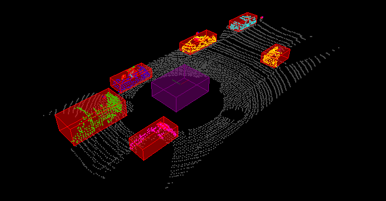

# Lidar PCD processing

## Lidar introduction

Lidar sensing gives us high resolution data by sending out thousands of laser signals. These lasers bounce off objects, returning to the sensor where we can then determine how far away objects are by timing how long it takes for the signal to return. Also we can tell a little bit about the object that was hit by measuring the intensity of the returned signal. Each laser ray is in the infrared spectrum, and is sent out at many different angles, usually in a 360 degree range. While lidar sensors gives us very high accurate models for the world around us in 3D, they are currently very expensive, upwards of $60,000 for a standard unit.

## Lidar pcd processing pipeline

The project implements a processing pipeline applied on a stream pcd:
1. A voxel sub-sampling, region cropping and ego car roof points filtering. Entry point: `processPointClouds.cpp` `ProcessPointClouds<PointT>::FilterCloud`
2. A road road (point cloud) segmentation: using RANSAC for planes to separate obstacles from road points. Entry point: `quiz/ransaz/ransac_plane.h`
3. Obstacles clustering (segmentation) with euclidean clustering (using K-D tree). Entry point `quiz/cluster/cluster.h`

The rendered output is shown below:


## Dependencies installation and project building

### Ubuntu Xenial 16.04.x (tested)

tested PCL version: PCL 1.7

```bash
$> sudo apt install libpcl-dev
$> cd ~
$> git clone https://github.com/udacity/SFND_Lidar_Obstacle_Detection.git
$> cd SFND_Lidar_Obstacle_Detection
$> mkdir build && cd build
$> cmake ..
$> make
$> ./environment
```